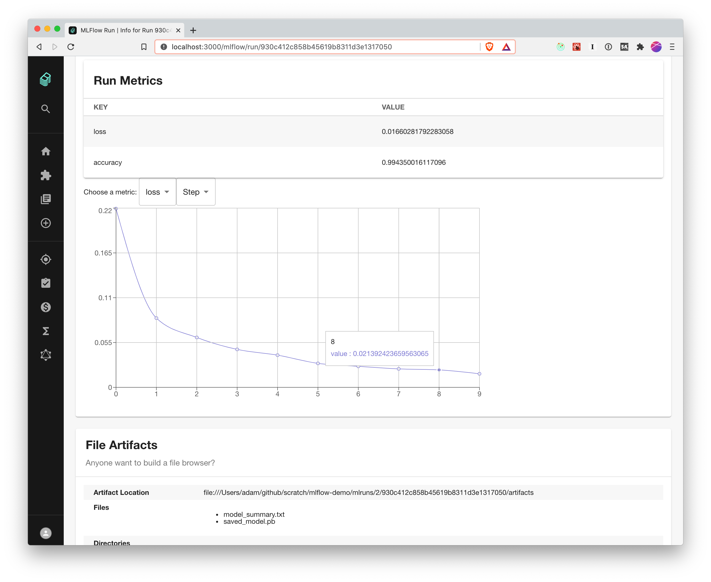

# MLFlow examples.

This will hold a few examples for training models and submitting them to the mlflow tracker, to be surfaced via the [MLFlow Backstage plugin](http://www.github.com/alaiacano/backstage). The hard-coded paths should indicate the state of this repo.

- `component-info.yaml` contains the required configuration for a Backstage component. You can "register an existing component" in backstage and give it the path to this file.
- `src/mnist_trainer.py` - trains an image classifier on the mnist dataset.
- `src/backstage_utils.py` - some helpers for reading `component-info.yaml` and configuring the mlflow sdk appropriately.

With Backstage and the MLFlow server running, the `mnist_trainer` script will produce views like this:

